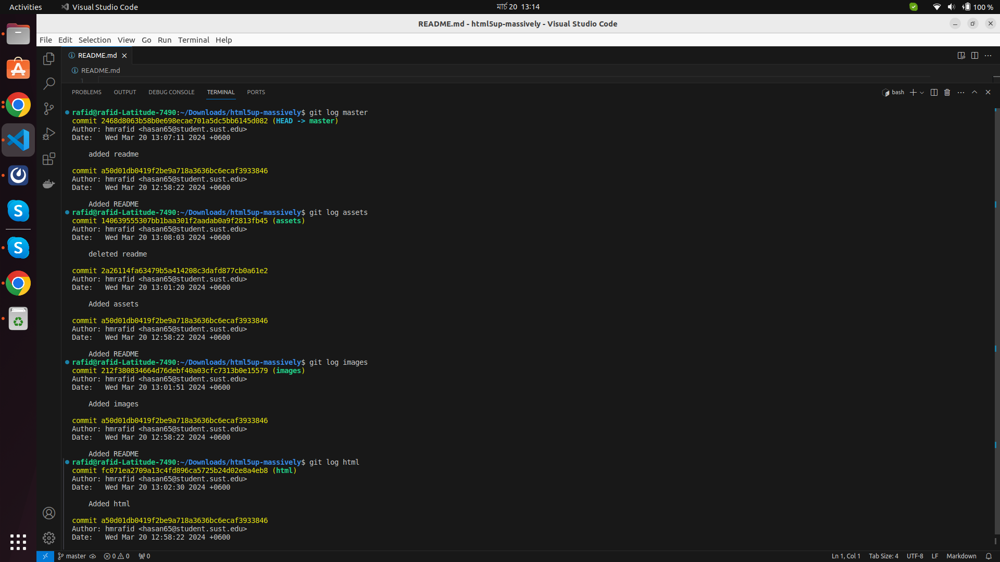
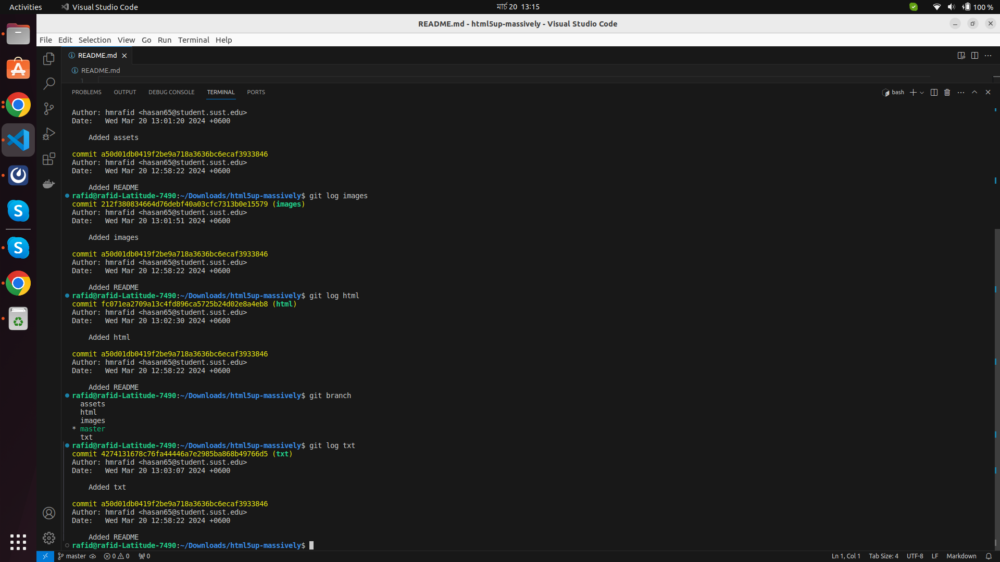

This is a demo project which I downloaded from https://html5up.net/ to practice git branching. I deployed it using GitHub pages.

* Created different branches for different directories and file types.
* Merged all branches to the master branch.
* Ensured linear commit history.

